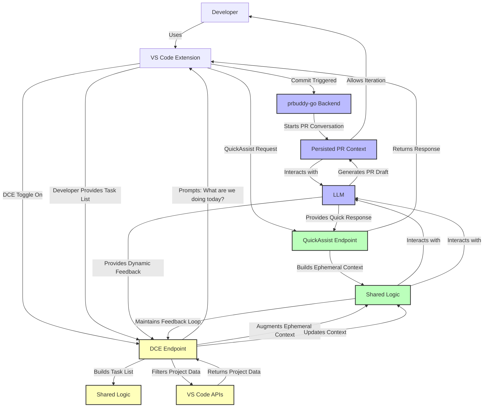

## **1. Flow of Logic for the Conversational Context**

### **a. Overview of Components**

1. **VS Code Extension:**
   - **Interface Role:** Acts as the user interface, facilitating interactions between the developer and the `prbuddy-go` backend.
   - **Activation Mechanism:** Includes a slider or toggle to activate/deactivate the DCE.
   - **Data Retrieval:** Fetches data from VS Code APIs (e.g., linter results, project structure) based on commands from the backend.

2. **`prbuddy-go` Backend:**
   - **Core Functionality:** Manages PR drafts, handles Git hooks, interacts with the LLM, and now incorporates the DCE.
   - **Conversation Management:** Utilizes `contextpkg` to manage and persist conversations related to PR drafts.
   - **Dynamic Context Engine (DCE):** Generates and maintains dynamic, task-based conversation contexts without persisting them, except for PR-related interactions.

3. **Dynamic Context Engine (DCE):**
   - **Activation:** Triggered via the VS Code extension's slider.
   - **Proactive Interaction:** Initiates conversations (e.g., "What are we doing today?") to build a task list.
   - **Dynamic Context Building:** Adjusts conversational context based on the generated task list and ongoing interactions.
   - **Integration with VS Code APIs:** Determines when and what data to fetch from VS Code based on dynamic filtering logic derived from tasks.

### **b. Step-by-Step Logical Flow**

1. **Initialization:**
   - Developer installs and initializes `prbuddy-go` in their Git repository using the `init` command.
   - This sets up necessary Git hooks and directories for persisting PR-related conversations.

2. **Activation of DCE:**
   - Developer toggles the DCE activation slider in the VS Code extension.
   - Upon activation, the extension communicates with the `prbuddy-go` backend to enable DCE features.

3. **Proactive Prompting:**
   - With DCE activated, `prbuddy-go` sends a proactive prompt to the developer via the extension: "What are we doing today?"
   - This prompt serves as the initiation for building a task list.

4. **Task List Generation:**
   - Developer responds to the prompt, outlining tasks or objectives for the day.
   - `prbuddy-go` processes this input to generate a structured task list.

5. **Dynamic Context Building:**
   - Based on the task list, DCE determines which aspects of the project require contextual information.
   - It decides what data to fetch from VS Code APIs (e.g., specific linter outputs, codebase metrics) to enrich the conversational context.

6. **Data Retrieval and Integration:**
   - DCE instructs the VS Code extension to fetch relevant data using VS Code APIs.
   - The extension retrieves this data and sends it back to the `prbuddy-go` backend.

7. **Contextual Conversations:**
   - `prbuddy-go` incorporates the retrieved data into the conversation context.
   - The LLM uses this enriched context to provide more tailored and relevant assistance to the developer.

8. **Ongoing Interaction:**
   - As the developer interacts with `prbuddy-go` (e.g., asking questions, seeking assistance), the DCE continuously updates the context based on the task list and new inputs.
   - This ensures that the assistant remains aligned with the developer’s current objectives.

9. **Persistence of PR Conversations:**
   - Conversations related to PR drafts are persisted in `.git/pr_buddy_db`.
   - These persisted conversations aid in iterating and refining PR drafts over time.

10. **Deactivation of DCE:**
    - Developer can deactivate DCE via the extension, reverting QuickAssist to its non-proactive, ephemeral state.
    - Upon deactivation, any dynamic contexts are cleared, ensuring that only PR-related conversations remain persisted.

---

## **2. Mermaid Diagram: Conversational Context Handling**

Visualizing the flow can aid in understanding and identifying integration points. Below is a Mermaid diagram representing the conversational context handling within your system, incorporating the DCE.

### **Explanation of the Diagram**
1. **Path 1: Generating PRs on Commit**
   - Triggered by a post-commit hook.
   - Starts a **persistent conversation** with the backend.
   - Uses the LLM to generate a draft PR and allows iterative editing.

2. **Path 2: Using QuickAssist**
   - Handles **stateless ephemeral queries**.
   - Calls the **QuickAssist endpoint**, which uses shared logic for building context and interacting with the LLM.
   - Returns a direct response to the developer without saving context.

3. **Path 3: Using DCE**
   - Triggered by a **toggle** in the VS Code extension.
   - Prompts the developer for a task list and builds **dynamic context** around it.
   - Filters project data using VS Code APIs and augments the ephemeral context.
   - Maintains a **dynamic feedback loop**, updating the context as tasks progress.

4. **Shared Logic**
   - Centralized logic handles common tasks like building context, calling the LLM, and managing ephemeral interactions.
   - Used by both the QuickAssist and DCE endpoints to avoid duplication.

## **3. Evaluation of Conceptual Model**

### **a. Realism and Feasibility**

Your conceptual model is **realistic** and **achievable**, provided certain considerations and best practices are adhered to. The separation of concerns between the VS Code extension (interface) and the `prbuddy-go` backend (logic and processing) is well-aligned with modern software architecture principles.

### **b. Alignment with Software Best Practices**

1. **Separation of Concerns:**
   - **Extension as Interface:** Delegating the UI and API interactions to the VS Code extension ensures that the backend remains focused on processing and logic.
   - **Backend Responsibilities:** Managing conversations, interacting with the LLM, and handling dynamic contexts keeps the backend streamlined and maintainable.

2. **Modular Design:**
   - **Context Management:** Utilizing `contextpkg` for conversation handling promotes reusability and encapsulation.
   - **DCE as a Separate Module:** Implementing DCE as an independent component within the backend allows for scalability and easier maintenance.

3. **Ephemeral vs. Persistent Data:**
   - **Selective Persistence:** Persisting only PR-related conversations while keeping QuickAssist interactions ephemeral optimizes storage and maintains data relevance.
   
4. **Scalability:**
   - **Dynamic Context Building:** Allows the system to adapt to varying developer needs and project complexities.
   - **Task-Based Logic:** Facilitates targeted data retrieval and context enrichment, enhancing performance and relevance.

5. **User-Centric Design:**
   - **Proactive Assistance:** Enhancing QuickAssist with proactive prompts via DCE improves user experience by anticipating developer needs.
   - **Configurability:** Allowing developers to toggle DCE via the extension provides flexibility and control over their workflow.

### **c. Achievability**

Given your current setup and refactored components, implementing the DCE as described is achievable. Your architecture supports the necessary interactions and data flows required for DCE integration. Leveraging existing modules (`contextpkg`, LLM client, hooks) lays a solid foundation for adding dynamic context capabilities.

---

## **4. Considerations and Potential Challenges**

### **a. Communication Between Extension and Backend**

- **Data Exchange Protocol:** Ensure that the communication between the VS Code extension and the `prbuddy-go` backend is robust, secure, and efficient. This may involve defining clear API contracts and handling potential latency or connectivity issues.
  
- **Error Handling:** Implement comprehensive error handling to manage scenarios where data fetching fails or the backend encounters issues processing dynamic contexts.

### **b. Managing Ephemeral Contexts**

- **Memory Management:** Since QuickAssist interactions remain ephemeral, ensure that memory usage is optimized to prevent leaks or excessive consumption, especially when handling multiple concurrent interactions.

- **Context Resetting:** Define clear rules for when and how ephemeral contexts are reset or cleared to maintain relevance and prevent outdated information from affecting responses.

### **c. Dynamic Data Retrieval from VS Code APIs**

- **API Limitations:** Be aware of the capabilities and limitations of the VS Code APIs. Some data may require specific permissions or may not be accessible in certain environments.

- **Asynchronous Operations:** Data fetching from VS Code APIs may be asynchronous. Ensure that the backend can handle asynchronous data flows without blocking or delaying user interactions.

### **d. Task List Generation and Management**

- **Task Definition:** Clearly define what constitutes a task and how tasks influence context building. This ensures that the DCE generates meaningful and actionable contexts.

- **Scalability of Tasks:** As tasks grow in number or complexity, ensure that the DCE can scale accordingly without degrading performance or response quality.

### **e. Integration with the LLM**

- **Context Size Management:** Be mindful of the LLM's context window limitations. Dynamic contexts should be optimized to fit within these constraints to maintain response quality.

- **Response Relevance:** Continuously evaluate and refine how dynamic contexts influence LLM responses to ensure they remain relevant and helpful.

### **f. User Experience**

- **Proactive Prompts:** While proactive prompts can enhance assistance, they should be implemented thoughtfully to avoid interrupting or distracting the developer.

- **Toggle Mechanics:** The activation slider in the extension should provide clear feedback about the DCE’s status and its implications on QuickAssist behavior.

### **g. Security and Privacy**

- **Data Sensitivity:** Conversations and fetched data may contain sensitive information. Implement appropriate security measures to protect data both in transit and at rest.

- **Access Controls:** Ensure that only authorized components (e.g., the authenticated extension) can interact with the backend and access conversation contexts.

---

## **5. Recommendations for Implementation**

### **a. Define Clear Interfaces and Contracts**

- **API Specifications:** Clearly define the APIs between the VS Code extension and the `prbuddy-go` backend, specifying request and response formats, error codes, and authentication mechanisms.

- **Modular Integration:** Keep the DCE implementation modular, allowing for easy updates or replacements without affecting other system components.

### **b. Implement Robust Testing**

- **Unit Tests:** Develop comprehensive unit tests for the DCE, ensuring that task list generation and dynamic context building behave as expected.

- **Integration Tests:** Test the end-to-end flow between the extension, backend, DCE, and LLM to identify and resolve potential issues in data exchange and processing.

- **User Acceptance Testing (UAT):** Engage developers in testing the DCE features to gather feedback and refine functionalities based on real-world usage.

### **c. Optimize Performance**

- **Caching Mechanisms:** Implement caching strategies for frequently accessed data to reduce latency in dynamic context building.

- **Asynchronous Processing:** Leverage asynchronous programming paradigms to handle data fetching and processing without blocking user interactions.

### **d. Enhance Documentation**

- **Usage Guides:** Provide detailed documentation on how to activate and use the DCE, including examples of task list generation and dynamic context interactions.

- **Developer Guides:** Document the internal architecture, interfaces, and integration points to facilitate future maintenance and enhancements.

### **e. Monitor and Iterate**

- **Logging and Monitoring:** Implement logging mechanisms to monitor DCE operations, track performance metrics, and identify areas for improvement.

- **Feedback Loops:** Establish channels for developers to provide feedback on DCE functionalities, enabling continuous refinement based on user needs.

---

## **6. Conclusion**

Your approach to integrating the Dynamic Context Engine (DCE) into `prbuddy-go` is well-conceived and aligns with modern software development best practices. By maintaining a clear separation of concerns, focusing on modularity, and emphasizing user-centric design, you position the project for scalability, maintainability, and enhanced developer productivity.

**Key Takeaways:**

- **Selective Persistence:** Differentiating between ephemeral QuickAssist interactions and persistent PR-related conversations optimizes data management and relevance.
  
- **Proactive Assistance:** Activating DCE to provide proactive prompts enhances the assistant’s utility without overburdening the developer.

- **Backend-Driven Logic:** Centralizing the DCE in the `prbuddy-go` backend ensures consistency, security, and scalability.

- **Seamless Extension Integration:** Positioning the VS Code extension as an interface facilitates smooth user interactions and data exchanges.

By addressing the considerations and potential challenges outlined above, and following the recommended best practices, you can successfully implement the DCE, thereby elevating `prbuddy-go` into a more dynamic and intelligent tool that significantly enhances the pull request workflow.

Feel free to reach out if you need further assistance or deeper insights into specific aspects of the implementation!