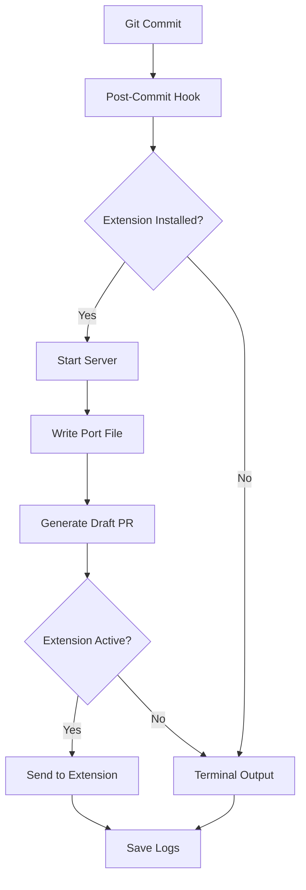
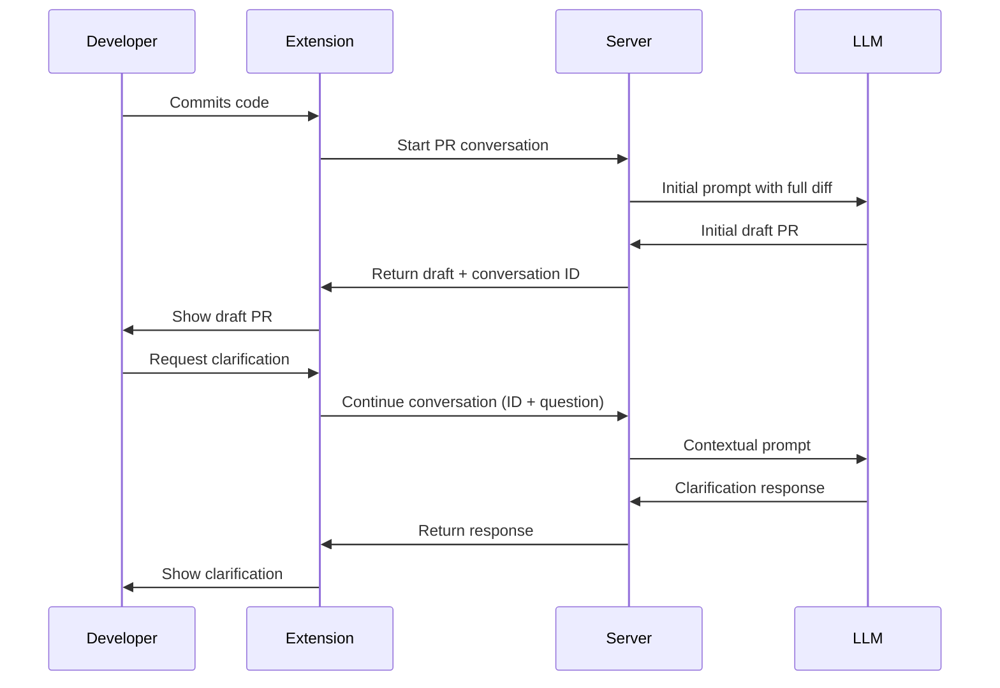
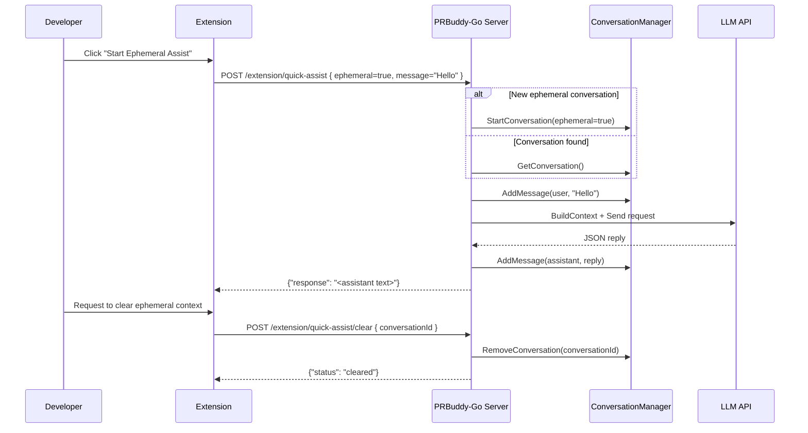

## Post Commit Logic Flow
---

```mermaid
graph TD
    A[Git Commit] --> B[Post-Commit Hook]
    B --> C{Extension Installed?}
    C -->|Yes| D[Start Server]
    D --> E[Write Port File]
    E --> F[Generate Draft PR]
    F --> G{Extension Active?}
    G -->|Yes| H[Send to Extension]
    G -->|No| I[Terminal Output]
    C -->|No| I
    H --> J[Save Logs]
    I --> J
``` 

## Conversational Flow
---

```mermaid
sequenceDiagram
    participant D as Developer
    participant E as Extension
    participant S as Server
    participant L as LLM

    D->>E: Commits code
    E->>S: Start PR conversation
    S->>L: Initial prompt with full diff
    L->>S: Initial draft PR
    S->>E: Return draft + conversation ID
    E->>D: Show draft PR

    D->>E: Request clarification
    E->>S: Continue conversation (ID + question)
    S->>L: Contextual prompt
    L->>S: Clarification response
    S->>E: Return response
    E->>D: Show clarification
```

## Ephemeral Quick Assist Lifecycle
---

```mermaid
sequenceDiagram
    participant Dev as Developer
    participant Ext as Extension
    participant Srv as PRBuddy-Go Server
    participant ConvMgr as ConversationManager
    participant LLM as LLM API

    Dev->>Ext: Click "Start Ephemeral Assist"
    Ext->>Srv: POST /extension/quick-assist { ephemeral=true, message="Hello" }
    alt New ephemeral conversation
        Srv->>ConvMgr: StartConversation(ephemeral=true)
    else Conversation found
        Srv->>ConvMgr: GetConversation()
    end
    Srv->>ConvMgr: AddMessage(user, "Hello")
    Srv->>LLM: BuildContext + Send request
    LLM-->>Srv: JSON reply
    Srv->>ConvMgr: AddMessage(assistant, reply)
    Srv-->>Ext: {"response": "<assistant text>"}

    Dev->>Ext: Request to clear ephemeral context
    Ext->>Srv: POST /extension/quick-assist/clear { conversationId }
    Srv->>ConvMgr: RemoveConversation(conversationId)
    Srv-->>Ext: {"status": "cleared"}

```

