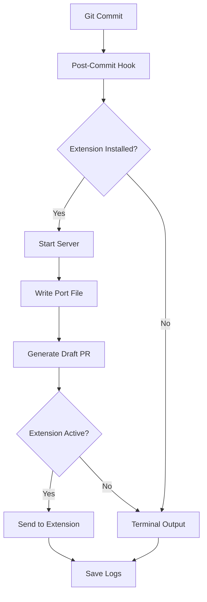

```mermaid
graph TD
    A[Git Commit] --> B[Post-Commit Hook]
    B --> C{Extension Installed?}
    C -->|Yes| D[Start Server]
    D --> E[Write Port File]
    E --> F[Generate Draft PR]
    F --> G{Extension Active?}
    G -->|Yes| H[Send to Extension]
    G -->|No| I[Terminal Output]
    C -->|No| I
    H --> J[Save Logs]
    I --> J
``` 