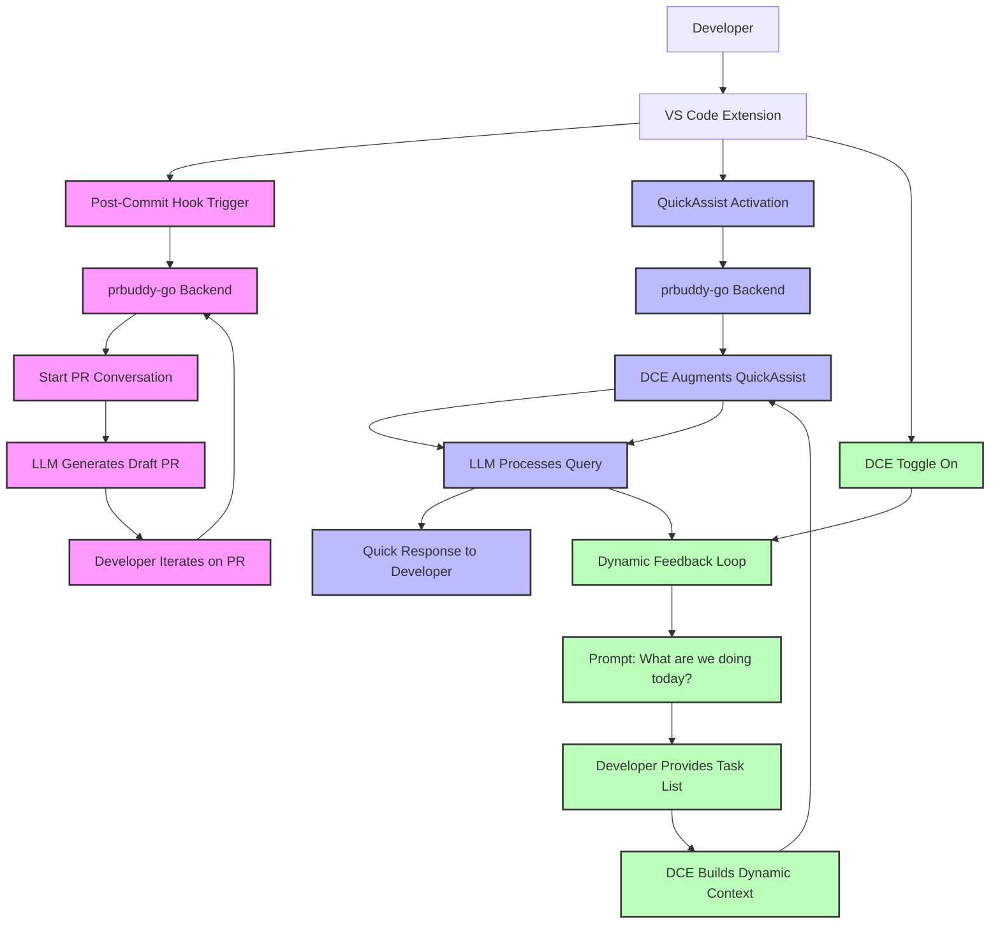

Refined Mermaid Diagram: Developer Interaction with VS Code Extension

```mermaid
graph TD
    A[Developer] --> B[VS Code Extension]

    %% Path 1: Generating PRs on Commit
    B --> C1[Post-Commit Hook Trigger]
    C1 --> D1[prbuddy-go Backend]
    D1 --> E1[Start PR Conversation]
    E1 --> F1[LLM Generates Draft PR]
    F1 --> G1[Developer Iterates on PR]
    G1 --> D1

    %% Path 2: Using QuickAssist
    B --> C2[QuickAssist Activation]
    C2 --> D2[prbuddy-go Backend]
    D2 --> E2[Create Ephemeral Context]
    E2 --> F2[LLM Processes Query]
    F2 --> G2[Quick Response to Developer]

    %% Path 3: Activating DCE
    B --> C3[DCE Toggle On]
    C3 --> H3[DCE Loop Initialized]
    H3 --> F3[Prompt: What are we doing today?]
    F3 --> G3[Developer Provides Task List]
    G3 --> I3[DCE Builds Dynamic Context]
    I3 --> E2[DCE Augments QuickAssist]
    E2 --> F2
    F2 --> H3[Dynamic Feedback Loop]

    %% Styling for clarity
    classDef path1 fill:#f9f,stroke:#333,stroke-width:2px;
    classDef path2 fill:#bbf,stroke:#333,stroke-width:2px;
    classDef path3 fill:#bfb,stroke:#333,stroke-width:2px;

    class C1,D1,E1,F1,G1 path1;
    class C2,D2,E2,F2,G2 path2;
    class C3,H3,F3,G3,I3 path3;

```
